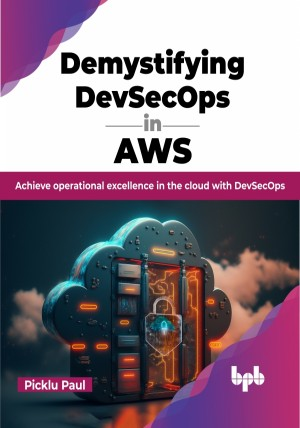

# Demystifying DevSecOps in AWS

Learn how to leverage DevSecOps to secure your modern enterprise in the cloud

This is the repository for [Demystifying DevSecOps in AWS
](https://bpbonline.com/products/demystifying-devsecops-in-aws?variant=42989443186888),published by BPB Publications.

## About the Book
“Demystifying DevSecOps in AWS” is a practical and insightful handbook designed to empower you in your pursuit of securing modern enterprises within Amazon Web Services (AWS) environments. 

This book delves deep into the world of DevSecOps, offering a thorough understanding of its fundamentals, principles, methodologies, and real-world implementation strategies. It equips you with the knowledge and skills needed to seamlessly integrate security into your development and operations workflows, fostering a culture of continuous improvement and risk mitigation. With step-by-step guidance and real-world examples, this comprehensive guide navigates the intricate landscape of AWS, showcasing how to leverage its services and tools to enhance security throughout the DevSecOps lifecycle. It bridges the gap between development, security, and operations teams, fostering collaboration and automation to fortify AWS pipelines.

This book is your one-stop shop for mastering DevSecOps in AWS. With it, you'll be able to protect your applications and data, and achieve operational excellence in the cloud.

## What You Will Learn
• Learn to infuse security into the DevOps lifecycle and master AWS DevSecOps.

•  Architect and implement a DevSecOps pipeline in AWS.

•  Scale DevSecOps practices to accommodate the growth of AWS environments.

•  Implement holistic security measures across the software lifecycle.

•  Learn real-world DevSecOps scenarios and lead DevSecOps initiatives.
